# Clientes ligeros con LTSP

En esta actividad vamos a usar dos máquinas virtuales para montar los clientes ligeros.

## 1. Servidor LTSP
### 1.1. Preparación MV
Comenzamos creando la máquina virtual que actuará como servidor LTSP. Esta máquina tendrá dos interfaces de red, una en *adaptador puente* para poder salir a Internet, y la otra en *red interna*, que se comunicará con las máquinas clientes.

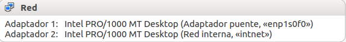

### 1.2. Instalación del SSOO
El sistema operativo elegido para nuestro servidor LTSP es Ubuntu, aunque es preferible utilizar una versión ligera, ya que consumen menos memoria.

Una vez instalada, procedemos a configurar ambos adaptadores de red, siguiendo la configuración dada  por el profesor. Al terminar la configuración de red, capturamos la salida de los siguientes comandos.

Comando ***ip a***

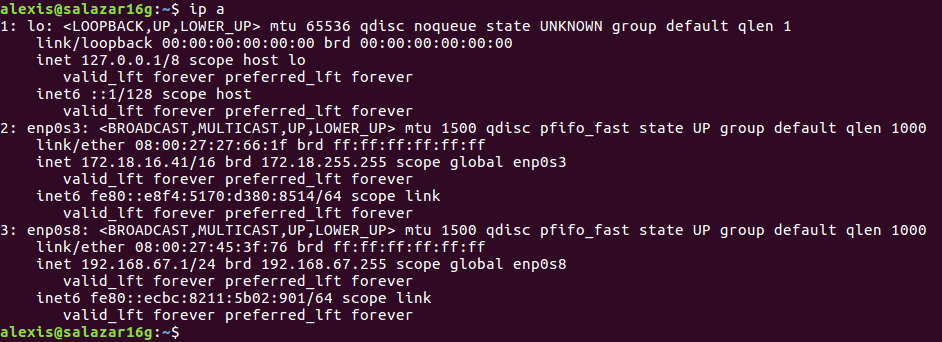

Comando ***route -n***

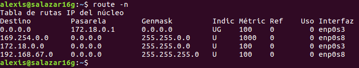

Comando ***hostname -a***

Comando ***hostname -f***

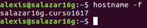

Comando ***uname -a***

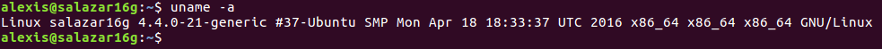

Comando ***blkid***

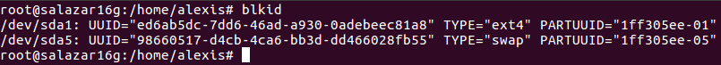

Para terminar la instalación y configuración del sistema operativo, creamos tres usuarios locales llamados *salazar1*, *salazar2* y *salazar3*.

### 1.3. Instalación del servicio LTSP
Instalamos el servidor de clientes ligeros, según la documentación para el sistema operativo elegido. En nuestro caso, al usar Ubuntu, lo instalamos con ***apt-get install ltsp-server-standalone***. Al finalizar la instalación, ejecutamos ***ltsp-build-client***, para crear la imagen del sistema operativo que se cargará en la memoria de  los clientes ligeros.

Ejecutamos ***ltsp-info*** para consultar información de la imagen que hemos creado.

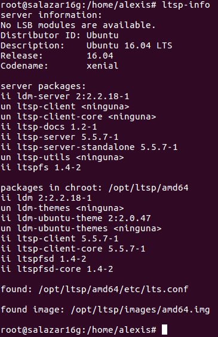

A continuación, revisamos la configuración del servicio DHCP instalado junto con el servicio LTSP. Para ello, consultamos el fichero de configuración ***/etc/ltsp/dhcpd.conf***. Comprobamos las rutas que aparecen en el archivo, y establecemos en todas ellas la opción de ***amd64***, en lugar de ***i386***, que venía por defecto.

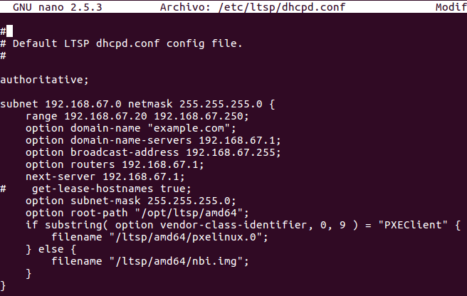

Para continuar, establecemos en el fichero ***/etc/default/isc-dhcp-server*** la interfaz sobre la que actuará el servicio DHCP. Esta interfaz es la configurada en *red interna*, que en nuestro caso es la ***enp0s8***.

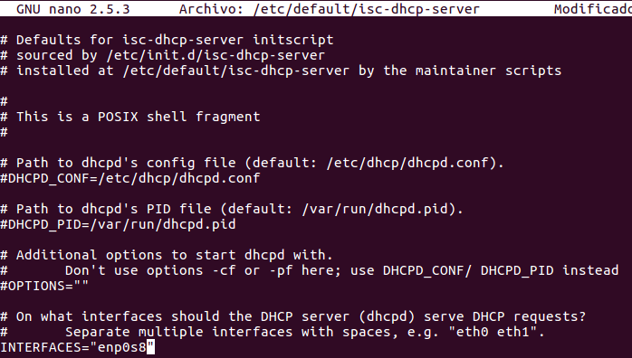

Para terminar este apartado, reiniciamos el servicio DHCP ejecutando el comando ***/etc/init.d/isc-dhcp-server restart*** y comprobamos su estado ejecutando ***/etc/init.d/isc-dhcp-server status***.

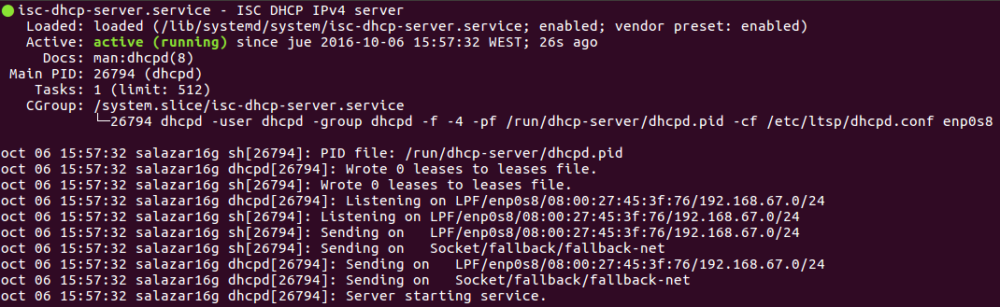

## 2. Preparar MV Cliente
Creamos la máquina cliente en VirtualBox con las siguientes opciones:
    
* Sin disco duro y sin unidad de DVD

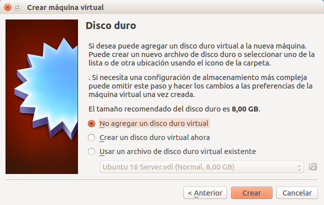

* Sólo tiene RAM, floppy
* Tarjeta de red en modo *red interna*

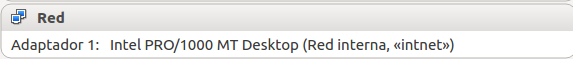

Para que la máquina cliente se inicie a través de la red, y reciba la  imagen que hemos creado anteriormente, vamos a la opción *Sistema* en la configuración de la MV, y establecemos *Red* como primera opción de arraque, deseleccionando la opción *Óptica* y *Disco duro*.

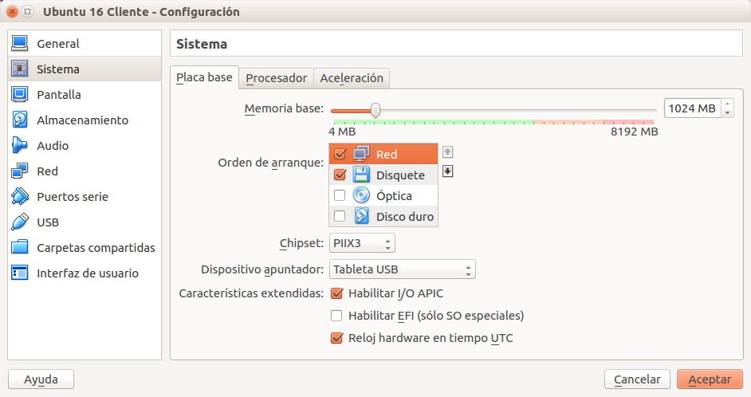

A continuación, vamos a comprobar que el cliente ligero se inicia correctamente.
[Video](https://www.youtube.com/watch?v=ThBN6T5CoAs) que muestra el funcionamiento de la práctica.

Para finalizar la actividad, vamos al servidor LTSP como superusuario, y ejecutamos y capturamos la salida de los siguientes comandos.

Comando ***arp***

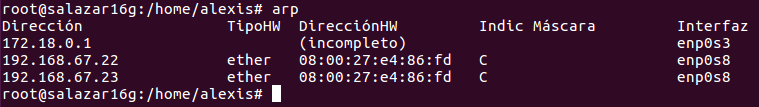

Comando ***whoami***

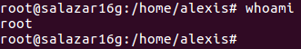

Comando ***who***

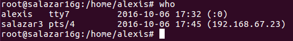