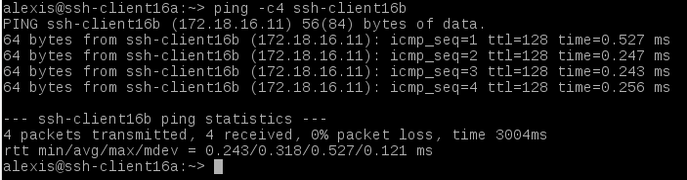
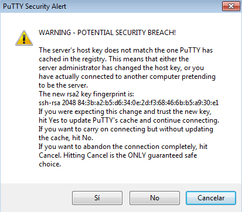
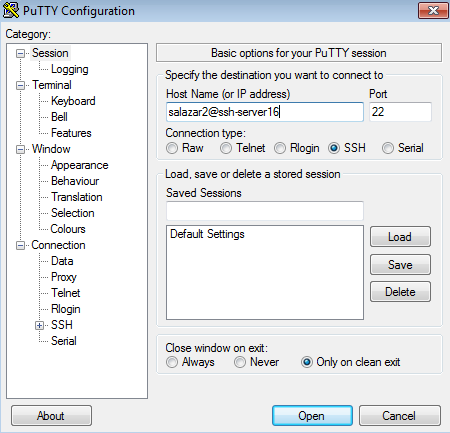

# Acceso remoto SSH

Para realizar esta práctica vamos a necesitar las siguientes 3 máquinas virtuales:

* Un servidor openSUSE 13.2
* Un cliente openSUSE 13.2
* Un cliente Windows 7

## 1. Preparativos
### 1.1. Servidor SSH (openSUSE 13.2)
Esta máquina será uno de los openSUSE 13.2 y tendrá la siguiente configuración:

* IP estática: 172.18.16.31
* Nombre de equipo: *ssh-server16*

Debemos añadir en el fichero ***/etc/hosts*** los equipos *ssh-client16a* y *ssh-client16b* para que dicho fichero realice la resolución de nombres.

Una vez configurada la máquina, ejecutamos y capturamos la salida de los siguientes comandos.

Comando ***ip a***

Comando ***route -n***

Comando ***ping -c4 8.8.4.4***

Comando ***host www.google.es***

Comando ***ping ssh-client16a***

Comando ***ping ssh-client16b***

Comando ***lsblk***

Comando ***blkid***

Continuamos creando 4 usuarios en *ssh-server16*.

![Usuario salazar1][1] ![Usuario salazar2][2] ![Usuario salazar3][3] ![Usuario salazar4][4]

[1]:./images/007.png
[2]:./images/008.png
[3]:./images/009.png
[4]:./images/010.png

### 1.2. Cliente openSUSE 13.2
Esta máquina será el segundo openSUSE 13.2 y tendrá la siguiente configuración:

* IP estática: 172.18.16.32
* Nombre de equipo: *ssh-client16a*

Debemos añadir en el fichero ***/etc/hosts*** los equipos *ssh-server16* y *ssh-client16b* para que dicho fichero realice la resolución de nombres.

Comprobamos la resolución de nombres haciendo *ping* a ambos equipos.

### 1.3. Cliente Windows 7
Para permitir el acceso SSH desde una máquina Windows debemos instalar PuTTY, el software cliente para sistemas Windows.

Configuramos esta máquina con los siguientes valores:

* IP estática 172.18.16.11
* Nombre de equipo: *ssh-client16b*

Debemos añadir en el fichero ***C:\Windows\System32\drivers\etc\hosts*** los equipos *ssh-server16* y *ssh-client16a* para que dicho fichero realice la resolución de nombres.

Comprobamos la resolución de nombres haciendo *ping* a ambos equipos.

## 2. Instalación del servicio SSH

Instalamos el servicio SSH en la máquina ssh-server16, ejecutando el comando ***zypper install openssh***.

### 2.1. Comprobación

Verificamos que el servicio está en ejecución con el comando ***systemctl status sshd***.

Con el comando ***netstat -ntap*** comprobamos que el servicio está escuchando por el puerto 22.

### 2.2. Primera conexión SSH desde cliente

Comenzamos comprobando la conectividad desde el cliente con el servidor haciendo *ping*.

Desde el cliente comprobamos que el servicio SSH es visible con nmap ssh-server16. Debe mostrarnos que el puerto 22 está abierto. Esto es, debe aparecer una línea como "22/tcp open ssh".

A continuación, vamos a comprobar el funcionamiento de la conexión SSH desde cada cliente usando el usuario *salazar1*. Para ello, desde el cliente openSUSE 13.2, ejecutamos ***ssh salazar1@ssh-server16***, y vemos como se produce el intercambio de claves que se produce en la primera conexión SSH.

Si cerramos la sesión y nos volvemos a conectar, vemos que ya no se produce el intercambio de claves entre ambas máquinas.

Continuamos comprobando el contenido del fichero ***.ssh/known_hosts*** en el equipo *ssh-client16a*.

La clave que aparece en este fichero es la que se ha usado en la identificación con la máquina *ssh-server16*.

Para iniciar una conexión remota desde Windows 7, ejecutamos PuTTY, e introducimos en la pestaña *Host Name (or IP address)*, salazar1@ssh-server16, el usuario y la máquina a la que queremos acceder.

Pulsamos en *Open*, y se produce el intercambio de claves entre las máquinas.

Para continuar, pulsamos en *Sí*, introducimos la contraseña y vemos como se ha establecido la conexión SSH.

### 2.3. ¿Y si cambiamos las claves del servidor?

Comprobamos el contenido del directorio ***/etc/ssh***.

A continuación debemos modificar el fichero ***/etc/ssh/sshd_config*** para dejar una única línea (*HostKey /etc/ssh/ssh_host_rsa_key*) descomentada con configuración *HostKey*. Con esta configuración, establecemos solamente el uso de claves RSA. 

Continuamos generando nuevas claves en *ssh-server16* con el comando ***ssh-keygen -t rsa -f /etc/ssh/ssh_host_rsa_key***.

Reiniciamos el servicio y comprobamos que está correctamente en ejecución.

Ahora comprobamos que sucede al volver a conectarnos desde los dos clientes, usando los usuarios *salazar1* y *salazar2*.

Lo que sucede, es que ya que hemos generado claves nuevas en nuestro servidor SSH, el cliente las compara al intentar conectarse, y da un error dado que el cliente no reconoce la nueva clave. Para solucionar este problema, y poder volver a conectar las máquinas entre sí, debemos eliminar la clave contenida en el fichero ***.ssh/known_hosts*** de la máquina cliente, e introducir en este mismo fichero la nueva clave generada, que está almacenada en el fichero ***/etc/ssh/ssh_host_rsa_key.pub***.

Comprobamos el nuevo contenido del fichero ***.ssh/known_hosts***.

Verificamos también que podemos iniciar una conexión SSH después de solucionar el problema de la nueva clave.

Por otro lado, al iniciar una conexión remota desde Windows con el usuario *salazar1*, vemos como aparece el mensaje de que la clave ha cambiado, pero pulsamos en *Sí*, introducimos la contraseña y verificamos que la conexión se ha establecido.

A continuación, al intentar establecer una conexión con el usuario *salazar2*, vemos que ya no aparece el mensaje de cambio de clave, y se establece la conexión correctamente.

## 3. Personalización del prompt Bash

Para personalizar el prompt cuando tenemos un conexión SSH activa, debemos iniciar sesión con el usuario al que queremos aplicar esta característica en *ssh-server16*, y modificamos el archivo ***/home/salazar1/.bashrc***, añadiendo las líneas que se muestran a continuación.

Además de realizar la configuración anterior, creamos el fichero ***/home/salazar1/.alias*** con el siguiente contenido:

Para comprobar el funcionamiento de lo realizado, iniciamos una conexión SSH desde cada cliente.

* Cliente openSUSE 13.2

* Cliente Windows 7

Podemos ver cómo ha cambiado el color y el texto que aparece en el prompt al tener una conexión SSH activa.

## 4. Autenticación mediante claves públicas

El objetivo de este apartado es el de configurar SSH para poder acceder desde el cliente openSUSE 13.2, usando el usuario *salazar4* sin poner contraseña, pero usando claves pública/privada.

Para ello, vamos a configurar la autenticación mediante clave pública para acceder con nuestro usuario personal desde el equipo cliente al servidor con el usuario *salazar4*.

Comenzamos iniciando sesión con nuestro usuario personal en la máquina *ssh-client16a*.

Ejecutamos el comando ***ssh-keygen -t rsa*** para generar un nuevo par de claves para el usuario personal en ***/home/alexis/.ssh/id_rsa*** y ***/home/alexis/.ssh/id_rsa.pub***.

A continuación tenemos que copiar la clave pública del usuario *alexis* de la máquina cliente al fichero *authorized_keys* del usuario remoto *salazar4*. Para ello, ejecutamos el comando ***ssh-copy-id salazar4@ssh-server16***.

Comprobamos que ahora podremos acceder remotamente, sin escribir la contraseña desde *ssh-client16a*.

Por el contrario, comprobamos que al acceder desde *ssh-client16b*, si se nos pide la contraseña.

## 5. Uso de SSH como túnel para X

Para realizar este apartado, instalamos en *ssh-server16* una aplicación de entorno gráfico que no esté en los clientes. En nuestro caso vamos a utilizar el editor Geany.

A continuación, tenemos que modificar el servidor SSH para permitir la ejecución de aplicaciones gráficas desde los clientes. Esta opción de configuración se encuentra en el fichero ***/etc/ssh/sshd_config***, en el cual tendremos que descomentar la línea *X11Forwarding yes*.

Para comprobar el funcionamiento de Geany desde *ssh-client16a* ejecutamos el comando ***ssh -X salazar1@ssh-server16*** para conectarnos de forma remota al servidor,

y ejecutamos Geany desde *ssh-client16a*.

Una vez guardado el fichero creado, iniciamos sesión como *salazar1* en *ssh-server16* y comprobamos que el archivo se encuentra en el *Escritorio*.

## 6. Aplicaciones Windows nativas

Comenzamos instalando el emulador *Wine* en *ssh-server16*.

Ahora podemos instalar alguna aplicación de Windows en el servidor SSH usando el emulador Wine. También podemos usar el block de notas que viene con Wine: wine notepad.

Comprobamos el funcionamiento de la aplicación *wine notepad* desde *ssh-server16*.

Comprobamos también el funcionamiento de la aplicación desde *ssh-client16a*.

Una vez que hemos guardado el archivo creado, iniciamos sesión en *ssh-server16* con el usuario *salazar1* y comprobamos que el fichero se encuentra en el *Escritorio*.

## 7. Restricciones de uso

En este apartado vamos a modificar los usuarios del servidor SSH para añadir algunas restricciones de uso del servicio.

### 7.1. Sin restricción (tipo 1)
+
El usuario *salazar1* podrá conectarse vía SSH sin restricciones.

* Cliente openSUSE 13.2

* Cliente Windows 7

### 7.2. Restricción total (tipo 2)

Esta restricción consiste en que el usuario *salazar2* no podrá conectarse por SSH a *ssh-server16* desde ambos clientes, por lo que sólo podrá ser usado de forma local.

Para aplicar esta configuración, debemos añadir en el fichero ***/etc/ssh/sshd_config*** una opción *DenyUsers*, en la cual indicamos los usuarios sobre los que queremos aplicar la restricción.

Una vez establecida la restricción, intentamos iniciar una conexión desde ambos clientes con el usuario *salazar2*, y vemos como nos aparece el mensaje de permiso denegado.

* Cliente openSUSE 13.2

* Cliente Windows 7

### 7.3. Restricción sobre aplicaciones (tipo 3)

En este apartado vamos a crear una restricción de permisos sobre determinadas aplicaciones.

Comenzamos creando el grupo *remoteapps* e introducimos en dicho grupo al usuario *salazar4*.

La aplicación sobre la que vamos a aplicar la restricción es *Geany*. Para ello, localizamos la ruta del ejecutable del programa, y vemos los permisos de la aplicación.

Para aplicar la restricción, cambiamos el grupo propietario de la aplicación con el comando ***chgrp remoteapps /usr/bin/geany***. Comprobamos que el grupo propietario es *remoteapps*. 

Continuamos estableciendo los permisos del ejecutable de *Geany* a 750. Realizamos esta acción para impedir que los usuarios que no pertenezcan al grupo *remoteapps* puedan ejecutar el programa.

Comprobamos el funcionamiento de la restricción desde *ssh-server16*.

* Desde un usuario normal

* Desde el usuario *salazar4*

Comprobamos también la restricción desde *ssh-client16a* con el usuario *salazar4* ejecutando el comando ***ssh -X salazar4@ssh-server16***.

