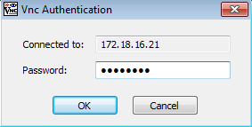

#Acceso remoto VNC

Para realizar esta actividad usaremos máquinas virtuales con openSUSE 13.2, Windows 7 y Windows 2012 Server.

##1. Configuración de las máquinas virtuales
###1.1. Windows 7
* Configuración de red

* Nombre de equipo y grupo de trabajo

###1.2. Windows 2012 Server
* Configuración de red

* Nombre de equipo y grupo de trabajo

###1.3. openSUSE 13.2 Server
* Configuración de red

* Nombre de equipo y grupo de trabajo

###1.4. openSUSE 13.2 Cliente
* Configuración de red

* Nombre de equipo y grupo de trabajo

##2. Conexiones remotas con VNC
Vamos a realizar las siguientes conexiones remotas VNC:
###2.1. Acceder a Windows 2012 Server desde Windows 7
Desde Windows 7 ejecutamos ***TightVNC Viewer*** e introducimos la dirección IP del Windows Server 2012.

Una vez introducida la dirección IP, pulsamos en *Connect*, y establecemos la contraseña que hemos designado en la configuración.

Pulsamos *OK* y vemos como se ha establecido la conexión remota entre las dos máquinas.

Para comprobar la conexión entre las dos máquinas, ejecutamos el comando ***netstat -n***.

###2.2. Acceder a Windows 2012 Server desde openSUSE 13.2
En una terminal de la consola, y como superusuario, ejecutamos ***vncviewer*** para comenzar la conexión remota.
Comenzamos introduciendo la dirección IP del Windows 2012 Server. 

A continuación, establecemos la contraseña designada para el acceso remoto.

Pulsamos *OK* y vemos como se ha establecido la conexión remota entre las dos máquinas.

Para comprobar la conexión entre las dos máquinas, ejecutamos el comando ***netstat -ntap***.

###2.3. Acceder a OpenSUSE 13.2 desde OpenSUSE 13.2
En una terminal de la consola, y como superusuario, ejecutamos ***vncviewer*** para comenzar la conexión remota.
Comenzamos introduciendo la dirección IP del openSUSE 13.2 que queremos conectar acompañada del puerto por el que se va a acceder. 

Pulsamos en *Connect* y vemos la conexión establecida entre ambas máquinas virtuales.

Para comprobar el estado de la conexión, ejecutamos el comando ***netstat -ntap***.

###2.4. Acceder a OpenSUSE 13.2 desde Windows 7
Ejecutamos ***TightVNC Viewer*** y ponemos la dirección IP de la máquina openSUSE 13.2, con el puerto por el que se va a acceder.

Pulsamos en *Connect* y vemos la conexión establecida entre ambas máquinas.

Para finalizar, comprobamos la conexión con ***netstat -n***.

