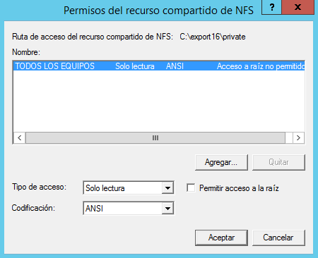
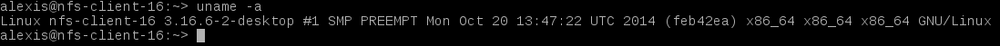
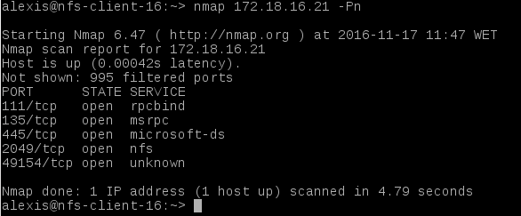

# NFS (Network File System)
NFS es un protocolo para compartir recursos en red entre sistemas heterogéneos.

## 1. SO Windows
Para esta parte vamos a necesitar las siguientes máquinas:

*  Servidor NFS
	* Windows 2012 Server
* Cliente NFS
	* openSUSE 13.2

### 1.1. Servidor NFS Windows
Esta máquina será un Windows 2012 Server y tendrá la siguiente configuración:

* IP estática: 172.18.16.21

* Nombre de equipo y nombre de dominio

Una vez configurada la máquina, ejecutamos los siguientes comandos de comprobación:

Comando ***date***

Comando ***ipconfig***

Comando ***ping 8.8.4.4***

Comando *** nslookup www.iespuertodelacruz.es***

Este comando no obtiene respuesta porque hemos establecido como servidor DNS primario la dirección IP 172.18.16.21, es decir, el servidor DNS primario de la máquina es la propia máquina, y debido a que ésta no es un servidor DNS, el comando no obtiene el resultado esperado.

#### 1.1.1. Instalación del servicio NFS
Procedemos a instalar el servicio NFS. Para ello vamos a *Roles y características*, agregamos el rol *Servidor de Archivos* y marcamos *Servidor para NFS*.

#### 1.1.2. Configurar el servidor NFS
Creamos la carpeta *C:\export16\public*. Picamos en la carpeta con el botón derecho -> Propiedades -> Compartir NFS, y la configuramos para que sea accesible desde la red en modo lectura/escritura con NFS.

Creamos la carpeta *C:\export16\private*. Picamos en la carpeta con el botón derecho -> Propiedades -> Compartir NFS, y la configuramos para que sea accesible desde la red sólo en modo sólo lectura.

Ejecutamos el comando ***showmount -e 172.18.16.21***, para comprobar que los recursos están exportados.

### 1.2. Cliente NFS
Esta máquina será un openSUSE 13.2 y tendrá la siguiente configuración:

* IP estática: 172.18.16.32
* Nombre de equipo: *nfs-client-16*

Una vez configurada la máquina, ejecutamos los siguientes comandos de comprobación:

Comando ***date***

Comando ***uname -a***

Comando ***hostname -f***

Comando ***hostname -a***

Comando ***hostname -d***

Comando ***tail -n 5 /etc/passwd***

Comando ***ip a***

Comando ***route -n***

Comando ***ping -c4 8.8.4.4***

Comando ***host www.iespuertodelacruz.es***

Comando ***blkid***

#### 1.2.1. Comprobar conectividad desde cliente al servidor

Comando ***ping -c4 172.18.16.21***

Comando ***nmap 172.18.16.21 -Pn***

Comando ***showmount -e 172.18.16.21***

#### 1.2.2. Montar y usar cada recurso compartido desde el cliente
Creamos las carpetas */mnt/remoto16/public* y */mnt/remoto16/private*.

Ejecutamos ***showmount -e 172.18.16.21*** para consultar los recursos que exporta el servidor.

A continuación montamos cada recurso compartido en su directorio local correspondiente.

Comenzamos con el recurso compartido *public*. Ejecutamos ***mount.nfs 172.18.16.21:/public /mnt/remoto16/public*** para montarlo y ***df -hT*** para comprobar que se ha montado correctamente.

Ahora vamos a crear ficheros/carpetas dentro del recurso *public*.

Montamos ahora el recurso compartido *private* con el comando ***mount.nfs 172.18.16.21:/private /mnt/remoto16/private***. Ejecutamos ***df -hT*** para comprobar el montaje.

Comprobamos que el recurso *private* es de sólo lectura.

Lanzamos el comando *** netstat -ntap*** para comprobar el acceso a los recursos NFS desde el cliente.

## 2. SO OpenSUSE
Vamos a necesitar las siguientes máquinas:

*  Servidor NFS
	* openSUSE 13.2
* Cliente NFS
	* openSUSE 13.2

### 2.1. Servidor NFS
Esta máquina será un openSUSE 13.2 y tendrá la siguiente configuración:

* IP estática: 172.18.16.31
* Nombre de equipo: *nfs-server-16*

Una vez configurada la máquina, ejecutamos los siguientes comandos de comprobación:

Comando ***date***

Comando ***uname -a***

Comando ***hostname -f***

Comando ***hostname -a***

Comando ***hostname -d***

Comando ***tail -n 5 /etc/passwd***

Comando ***ip a***

Comando ***route -n***

Comando ***ping -c4 8.8.4.4***

Comando ***host www.iespuertodelacruz.es***

Comando ***blkid***

Comenzamos instalando el servicio *NFS* por Yast.

Creamos las siguientes carpetas:

* */srv/export16/public*, usuario y grupo propietario nobody:nogroup

* */srv/export16/private*, usuario y grupo propietario nobody:nogroup, permisos 770

* Vamos configurar el servidor NFS de la siguiente forma:

	* La carpeta */srv/export16/public* será accesible desde toda la red en modo lectura/escritura.

	* La carpeta */srv/export16/private* será accesible sólo desde la IP del cliente, sólo en modo lectura.

Para ello usaremos o Yast o modificamos el fichero */etc/exports* añadiendo las siguientes líneas:

Para reiniciar el servicio NFS usamos el comando ***systemctl restart nfsserver*** y el comando ***systemctl status nfsserver*** para comprobar el estado del servicio.

Ejecutamos ***showmount -e localhost*** para mostrar la lista de recursos exportados por el servidor NFS.

### 2.2. Cliente NFS
Esta máquina será un openSUSE 13.2 y tendrá la siguiente configuración:

* IP estática: 172.18.16.32
* Nombre de equipo: *nfs-client-16*

Una vez configurada la máquina, ejecutamos los siguientes comandos de comprobación:

Comando ***date***

Comando ***uname -a***

Comando ***hostname -f***

Comando ***hostname -a***

Comando ***hostname -d***

Comando ***tail -n 5 /etc/passwd***

Comando ***ip a***

Comando ***route -n***

Comando ***ping -c4 8.8.4.4***

Comando ***host www.iespuertodelacruz.es***

Comando ***blkid***

#### 2.2.1. Comprobar conectividad desde cliente al servidor

Comando ***ping -c4 172.18.16.31***

Comando ***nmap 172.18.16.31 -Pn***

Comando ***showmount -e 172.18.16.31***

#### 2.2.2. Montar y usar cada recurso compartido desde el cliente
Creamos las carpetas */mnt/remoto16/public* y */mnt/remoto16/private*.

Ejecutamos ***showmount -e 172.18.16.31*** para consultar los recursos que exporta el servidor.

A continuación montamos cada recurso compartido en su directorio local correspondiente.

Comenzamos con el recurso compartido *public*. Ejecutamos ***mount.nfs 172.18.16.31:/public /mnt/remoto16/public*** para montarlo y ***df -hT*** para comprobar que se ha montado correctamente.

Ahora vamos a crear ficheros/carpetas dentro del recurso *public*.

Montamos ahora el recurso compartido *private* con el comando ***mount.nfs 172.18.16.31:/private /mnt/remoto16/private***. Ejecutamos ***df -hT*** para comprobar el montaje.

Comprobamos que el recurso *private* es de sólo lectura.

Lanzamos el comando *** netstat -ntap*** para comprobar el acceso a los recursos NFS desde el cliente.

### 2.3 Montaje automático
Acabamos de acceder a recursos remotos realizando un montaje de forma manual. Si reiniciamos el equipo cliente podremos ver que los montajes realizados de forma manual ya no están. Si queremos volver a acceder a los recursos remotos debemos repetir el proceso, a no ser que hagamos una configuración permanente o automática.

Vamos a configurar el montaje autoḿatico para el recurso compartido *public*.

Usamos Yast -> particionador -> NFS -> Añadir. Introducimos la dirección IP de la máquina en la que se encuentra el recurso compartido, el directorio remoto donde se encuentra el recurso y el directorio local donde se va a montar el recurso.

Vemos el montaje anterior en el fichero ***/etc/fstab***.

Reiniciamos la máquina y ejecutamos el comando ***df -hT*** para comprobar el montaje del recurso compartido *public*.

## 3. Preguntas
* ¿Nuestro cliente GNU/Linux NFS puede acceder al servidor Windows NFS? Si. Esta combinación la hemos realizado en el apartado 1.2 de la actividad.
* ¿Nuestro cliente Windows NFS podría acceder al servidor GNU/Linux NFS? No. Al usar una versión *Professional* de Windows 7, no se permite la instalación del servicio cliente para NFS.
* Fijarse en los valores de usuarios propietario y grupo propietario de los ficheros que se guardan en el servidor NFS, cuando los creamos desde una conexión cliente NFS.

