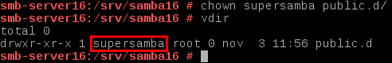
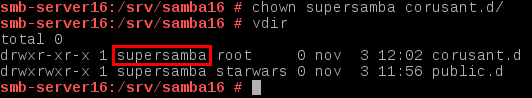
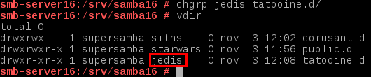
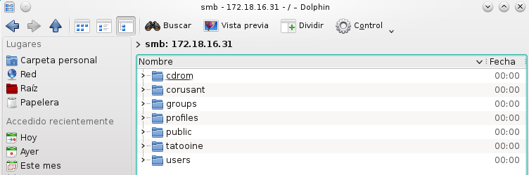

# Recursos compartidos SMB/CIFS

En esta actividad vamos a montar un servidor de recursos compartidos SMB/CIFS con openSUSE 13.2 y Windows 7. Para ello necesitaremos las las siguientes 3 máquinas virtuales:

* Un servidor openSUSE 13.2
* Un cliente openSUSE 13.2
* Un cliente Windows 7

## 1. Servidor openSUSE 13.2
### 1.1. Preparativos
Esta máquina será uno de los openSUSE 13.2 y tendrá la siguiente configuración:

* IP estática: 172.18.16.31
* Nombre de equipo: *smb-server16*

Debemos añadir en el fichero ***/etc/hosts*** los equipos *smb-cli16a* y *smb-cli16b* para que dicho fichero realice la resolución de nombres.

Una vez configurada la máquina, ejecutamos y capturamos la salida de los siguientes comandos.

Comando ***hostname -f***

Comando ***ip a***

Comando ***lsblk***

Comando ***sudo blkid***

### 1.2. Usuarios locales
Creamos los usuarios locales *jedi1*, *jedi2*, *sith1*, *sith2*, *smbguest* y *supersamba*.

Creamos los grupos *jedis*, *siths* y *starwars*, e introducimos en cada uno de ellos los usuarios que se indican a continuación.

* Grupo *jedis*: Usuarios *jedi1*, *jedi2* y *supersamba*.
* Grupo *siths*: Usuarios *sith1*, *sith2* y *supersamba*.
* Grupo *starwars*: Usuarios *jedi1*, *jedi2*, *sith1*, *sith2*, *smbguest* y *supersamba*.

En torno al usuario *smbguest*, para asegurarnos de que nadie puede usar dicho usuario y entrar en nuestra máquina a través de él, modificamos este usuario en el fichero ***/etc/passwd*** y le ponemos como shell */bin/false*.

### 1.3. Instalar Samba
Ejecutamos el comando ***zypper install samba*** para instalar el servicio *Samba*.

### 1.4. Crear las carpetas para los futuros recursos compartidos

Vamos a crear tres carpetas para los recursos compartidos.

#### Carpeta ***/srv/samba16/public.d***

* Creamos la carpeta ***/srv/samba16/public.d***.

Usamos el parámetro *-p* en el comando *mkdir* para crear, en el caso de que no existan, los directorios padre.

* Establecemos como usuario propietario de la carpeta ***/srv/samba16/public.d*** al usuario *supersamba*.

* Establecemos como grupo propietario de la carpeta ***/srv/samba16/public.d*** al grupo *starwars*.

* Modificamos a *775* los permisos de la carpeta ***/srv/samba16/public.d***.

#### Carpeta ***/srv/samba16/corusant.d***

* Creamos la carpeta ***/srv/samba16/corusant.d***.

* Establecemos como usuario propietario de la carpeta ***/srv/samba16/corusant.d*** al usuario *supersamba*.

* Establecemos como grupo propietario de la carpeta ***/srv/samba16/corusant.d*** al grupo *siths*.

* Modificamos a *770* los permisos de la carpeta ***/srv/samba16/corusant.d***.

#### Carpeta ***/srv/samba16/tatooine.d***

* Creamos la carpeta ***/srv/samba16/tatooine.d***.

* Establecemos como usuario propietario de la carpeta ***/srv/samba16/tatooine.d*** al usuario *supersamba*.

* Establecemos como grupo propietario de la carpeta ***/srv/samba16/tatooine.d*** al grupo *jedis*.

* Modificamos a *770* los permisos de la carpeta ***/srv/samba16/tatooine.d***.

### 1.5. Configurar el servidor Samba

Vamos a configurar los recursos compartidos del servidor Samba. Podemos hacerlo modificando el fichero de configuración o por entorno gráfico con Yast. En este caso vamos a realizar la configuración mediante el fichero ***/etc/samba/smb.conf***. Para comenzar, realizamos una copia de seguridad a dicho fichero con el comando ***cp /etc/samba/smb.conf /etc/samba/smb.conf.000***.

Una vez realizada la copia de backup del fichero de configuración, procedemos a modificarlo quedando como se muestra a continuación.

Abrimos una consola y ejecutamos los siguientes comandos para comprobar los resultados.

Comando ***cat /etc/samba/smb.conf***

Comando ***testparm***

### 1.6. Usuarios Samba
Después de crear los usuarios en el sistema, hay que añadirlos a Samba. Para ello, ejecutamos el comando ***smbpasswd -a nombreusuario***, para crear una clave de Samba para un usuario del sistema.

Ejecutamos el comando ***pdbedit -L*** para comprobar la lista de usuarios Samba.

### 1.7. Reiniciar

Una vez terminada la configuración del Samba, debemos reiniciar el servicio para que se lean los cambios realizados. Para ello, ejecutamos los comandos ***systemctl stop smb*** y ***systemctl start smb*** para detener e iniciar el servicio, y el comando ***systemctl status smb*** para comprobar que el servicio está activo.

Ejecutamos y capturamos la salida de los siguientes comandos de comprobación.

Comando ***sudo testparm***

Comando ***sudo netstat -tap***

## 2. Cliente Windows 7

Esta máquina Windows 7 tendrá la siguiente configuración:

* IP estática: 172.18.16.11

* Nombre de equipo: *smb-cli16b*

Debemos añadir en el fichero ***C:\Windows\System32\drivers\etc\hosts*** los equipos *smb-server16* y *smb-cli16a* para que dicho fichero realice la resolución de nombres.

### 2.1. Cliente Windows GUI

Desde un cliente Windows 7 vamos a acceder a los recursos compartidos del servidor Samba.

Comprobamos los accesos de todas las formas posibles.

* Acceso como un *invitado*

* Acceso como un *sith*

* Acceso como un *jedi*

A continuación, capturamos la salida de los siguientes comandos para comprobar los resultados.

Comando ***smbstatus***

Comando ***netstat -ntap***

Comando ***netstat -n***

### 2.2. Cliente Windows comandos

En el caso de que hubiera una conexión abierta la cerramos con el comando ***net use * /d /y***. Ejecutamos el comando ***net use*** para comprobar que no hay conexiones establecidas.

Usamos el comando ***net use /?*** para consultar la ayuda del comando.

Continuamos ejecutando el comando ***net view*** para ver las máquinas con recursos CIFS accesibles por la red.

Para finalizar este apartado, vamos a conectarnos desde la máquina Windows al servidor Samba usando el comando ***net use \\\172.18.16.31\tatooine /USER:jedi1***. Comprobamos el estado de la conexión con el comando ***net use***

### 2.3. Montaje automático

Vamos a proceder a realizar una conexión con uno de los recursos compartidos y montarlo en una unidad. Para ello, ejecutamos el comando ***net use S: \\\172.18.16.31\tatooine /USER:jedi1*** para montar el recurso *tatooine* en la unidad *S*.

Una vez realizado, comprobamos que se ha montado la unidad y podemos acceder a ella sin ningún problema.

Para finalizar, capturamos la salida de los siguientes comandos de comprobación.

Comando ***smbstatus***

Comando ***netstat -ntap***

Comando ***netstat -n***

## 3. Cliente openSUSE 13.2

Esta máquina será el segundo openSUSE 13.2 y tendrá la siguiente configuración:

* IP estática: 172.18.16.32
* Nombre de equipo: *smb-cli16a*

Debemos añadir en el fichero ***/etc/hosts*** los equipos *smb-server16* y *smb-cli16b* para que dicho fichero realice la resolución de nombres.

### 3.1. Cliente GNU/Linux GUI

Accedemos a los recursos del servidor Samba, pulsando *CTRL+L* y escribimos *smb://172.18.16.31*

Probamos la conexión con el recurso compartido *tatooine* con el usuario *jedi1*.

A continuación vamos a crear carpetas en los recursos *corusant* y *tatooine*.

Comprobamos también que el recurso *public* es de sólo lectura.

Para finalizar, capturamos la salida de los siguientes comandos de comprobación.

Comando ***smbstatus***

Comando ***netstat -ntap***

Comando ***netstat -n***

### 3.2. Cliente GNU/Linux comandos

Comenzamos comprobando el uso de las siguientes herramientas.

Comando ***sudo smbtree***

Comando ***smbclient --list 172.18.16.31***

Ahora creamos en local la carpeta ***/mnt/samba16-remoto/corusant***.

Con el usuario root, usamos el comando ***mount -t cifs //172.18.16.31/corusant /mnt/samba16-remoto/corusant -o username=sith1*** para montar un recurso compartido de Samba, como si fuera una carpeta más de nuestro sistema. Ejecutamos ***df -hT*** para comprobar que el recurso ha sido montado.

Para finalizar, capturamos la salida de los siguientes comandos de comprobación.

Comando ***smbstatus***

Comando ***netstat -ntap***

Comando ***netstat -n***

### 3.3. Montaje automático

Acabamos de acceder a los recursos remotos, realizando un montaje de forma manual. Si reiniciamos el equipo cliente, podremos ver que los montajes realizados de forma manual ya no están. Si queremos volver a acceder a los recursos compartidos debemos repetir el proceso de montaje manual, a no ser que hagamos una configuración de montaje permanente o automática.

Para configurar acciones de montaje automáticos cada vez que se inicie el equipo, debemos configurar el fichero ***/etc/fstab*** añadiendo la línea ***//smb-server16/public /mnt/samba16-remoto/public cifs username=sith1,password=78635302g 0 0***.

Para comprobar que el montaje automático funciona correctamente reiniciamos la máquina y ejecutamos el comando ***df -hT*** para ver que el recurso se ha montado correctamente.

## 4. Preguntas para resolver

* ¿Las claves de los usuarios en GNU/Linux deben ser las mismas que las que usa Samba? No necesariamente deben ser iguales. Los usuarios en el sistema y en Samba pueden tener contraseñas diferentes.
* ¿Puedo definir un usuario en Samba llamado *sith3*, y que no exista como usuario del sistema? No. Para utilizar un usuario en samba hay que crearlo anteriormente en el sistema.
* ¿Cómo podemos hacer que los usuarios *sith1* y *sith2* no puedan acceder al sistema pero sí al samba? (Consultar /etc/passwd) Buscamos la línea correspondiente a los usuarios a los que se les quiere negar el acceso y le ponemos como shell */bin/false*.
* Añadir el recurso *[homes]* al fichero ***/etc/samba/smb.conf*** según los apuntes. ¿Qué efecto tiene? La sección *[homes]* nos permitirá compartir las carpetas *home* de cada usuario, para que cada usuario pueda acceder a su carpeta *home* por la red. Se utiliza cuando se desean crear perfiles móviles de forma que cuando se identifique el usuario en cualquiera de los PCs de la red, se mapee de forma automática su perfil.
