# Servidor LDAP
En esta actividad vamos a montar un servidor LDAP con openSUSE 13.2. Para ello necesitaremos las siguientes 2 máquinas virtuales:

* Un servidor openSUSE 13.2
* Un cliente openSUSE 13.2

## 1. Servidor LDAP
Comenzamos la instalación y configuración del servidor LDAP.

### 1.1. Preparativos
Esta máquina será uno de los openSUSE 13.2 y tendrá la siguiente configuración:

* IP estática: 172.18.16.31
* Nombre de equipo: *ldap-server16*

Debemos añadir en el fichero ***/etc/hosts*** los distintos nombres DNS que tendrá la máquina que actuará como servidor LDAP.

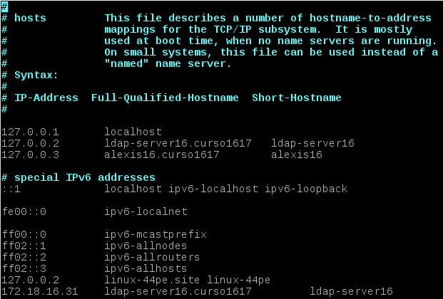

Una vez configurada la máquina, ejecutamos y capturamos la salida de los siguientes comandos.

Comando ***date***

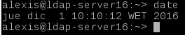

Comando ***uname -a***

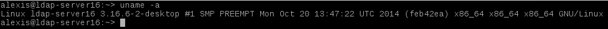

Comando ***hostname -f***

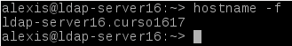

Comando ***hostname -a***

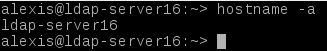

Comando ***hostname -d***

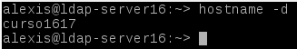

Comando ***tail -n 5 /etc/passwd***

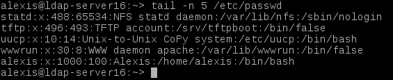

Comando ***ip a***

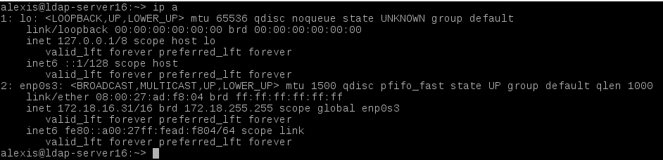

Comando ***route -n***

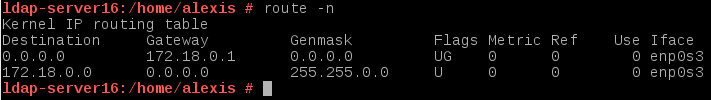

Comando ***ping -c4 8.8.4.4***

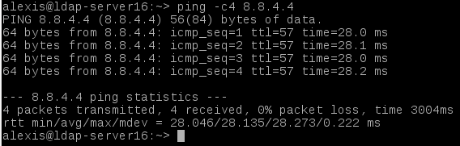

Comando ***host www.iespuertodelacruz.es***

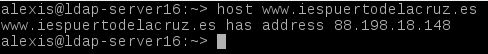

Comando ***blkid***

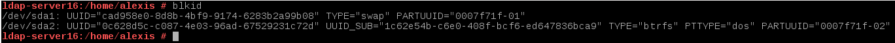

### 1.2. Instalación del Servidor LDAP

Procedemos a la instalación del módulo *yast2-auth-server*, que sirve para gestionar el servidor LDAP.

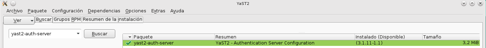

Una vez instalado, aparecerá en *Yast* como *Authentication Server*.

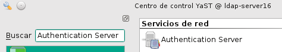

Al iniciarlo, es necesario instalar los paquetes *openldap2*, *krb5-server* y *krb5-client*.

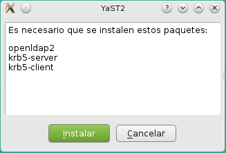

A continuación procedemos a configurar el servidor LDAP.

**Ajustes generales**

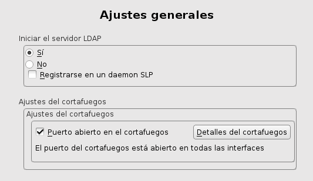

**Tipo de servidor**

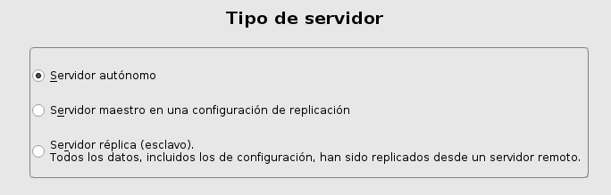

**Configuración de TLS**

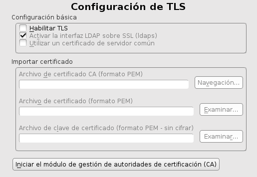

**Configuración básica de la base de datos**

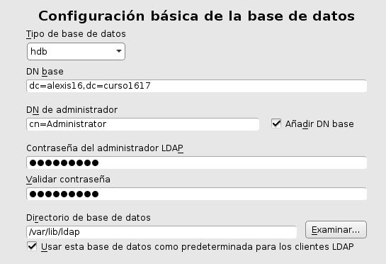

**Autenticación Kerberos**

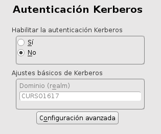

**Resumen de la configuración**

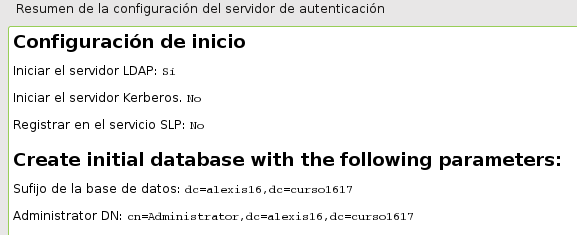

Una vez configurado el servicio LDAP, ejecutamos los siguientes comandos de comrobación.

Comando ***systemctl status slapd***

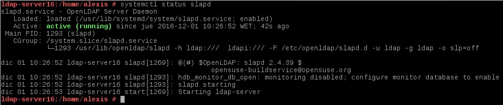

Comando ***nmap localhost | grep -P '389|636'***

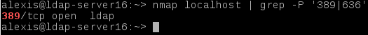

Comando ***slapcat***

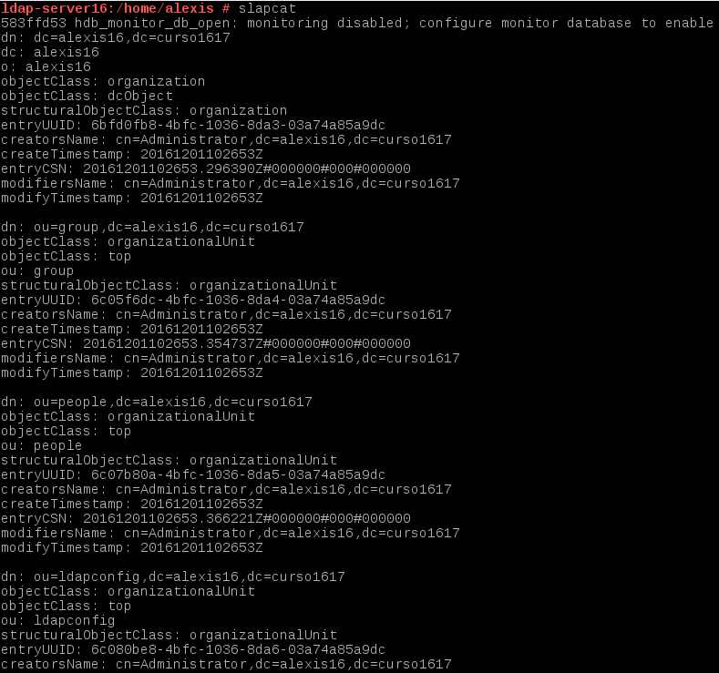
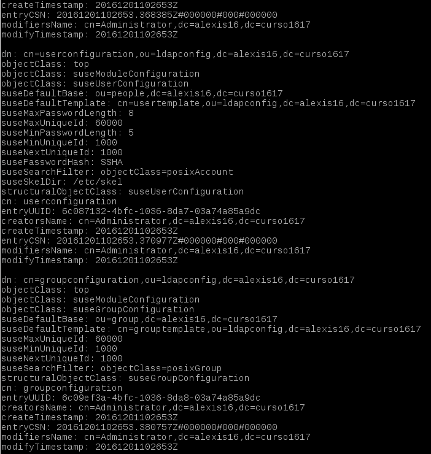
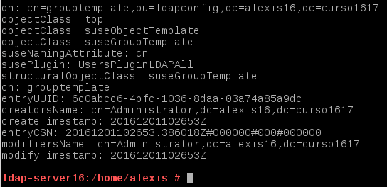

Instalamos la herramienta *gq* con el comando ***zypper install gq*** y comprobamos que se han creado las unidades organizativas *groups* y *people*.

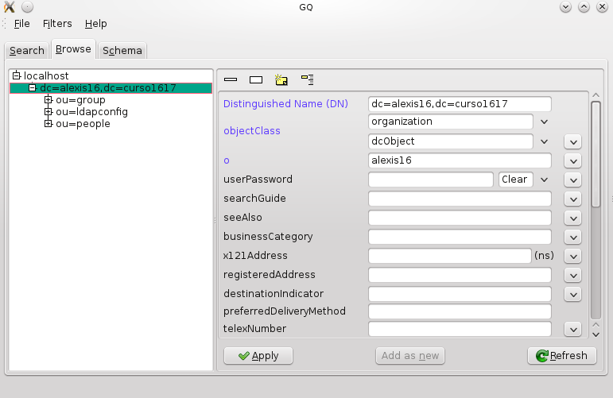

### 1.3. Problemas

Si tenemos que desinstalar cualquier paquete hacemos:

* zypper remove yast2-auth-server
* zypper remove openldap2 krb5-server krb5-client
* mv /etc/openldap /etc/openldap.000
* mv /var/lib/ldap /var/lib/ldap.000

### 1.4. Crear usuarios y grupos LDAP

Ejecutamos *Yast* y buscamos *Gestión de usuarios y grupos*. En el interior de esta herramienta gráfica, utilizamos el filtro LDAP y creamos el grupo *piratas*, que contendrá los usuarios *pirata21* y *pirata22*.

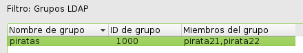

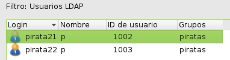

Iniciamos *gq* y comprobamos que se han creado el grupo *piratas* y los usuarios *pirata21* y *pirata22*.

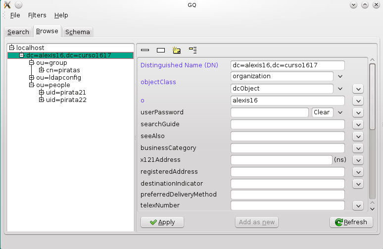

## 2. Autenticación
En este punto vamos a escribir información en el servidor LDAP.

### 2.1. Preparativos
Esta máquina será uno de los openSUSE 13.2 y tendrá la siguiente configuración:

* IP estática: 172.18.16.32
* Nombre de equipo: *ldap-slave16*

Debemos añadir en el fichero ***/etc/hosts*** los distintos nombres DNS que tendrá la máquina que actuará como cliente del servicio LDAP.

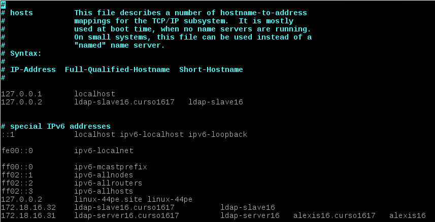

Una vez configurada la máquina, ejecutamos y capturamos la salida de los siguientes comandos.

Comando ***date***

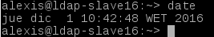

Comando ***uname -a***

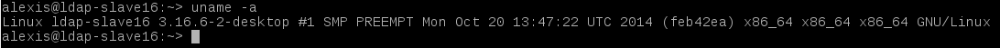

Comando ***hostname -f***

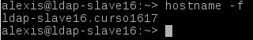

Comando ***hostname -a***

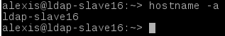

Comando ***hostname -d***

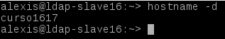

Comando ***tail -n 5 /etc/passwd***

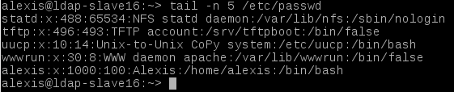

Comando ***ip a***

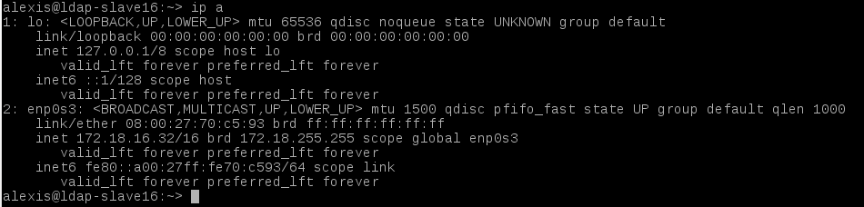

Comando ***route -n***

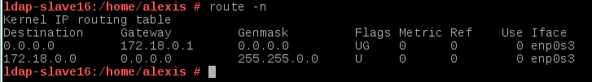

Comando ***ping -c4 8.8.4.4***

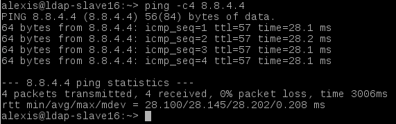

Comando ***host www.iespuertodelacruz.es***

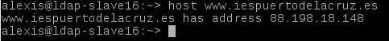

Comando ***blkid***

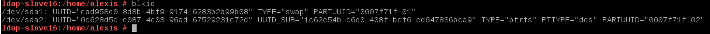

Ejecutamos el comando ***nmap ldap-server16 | grep -P '389|636'***  para comprobar que el servidor LDAP es accesible desde el cliente.

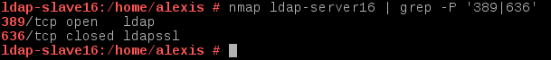

Debemos añadir el servidor LDAP en *gq* del cliente para poder utilizar los usuarios.

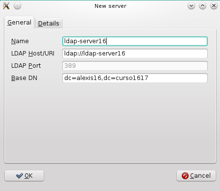

Iniciamos *gq* en el cliente y comprobamos que se han creado el grupo *piratas* y los usuarios *pirata21* y *pirata22*.

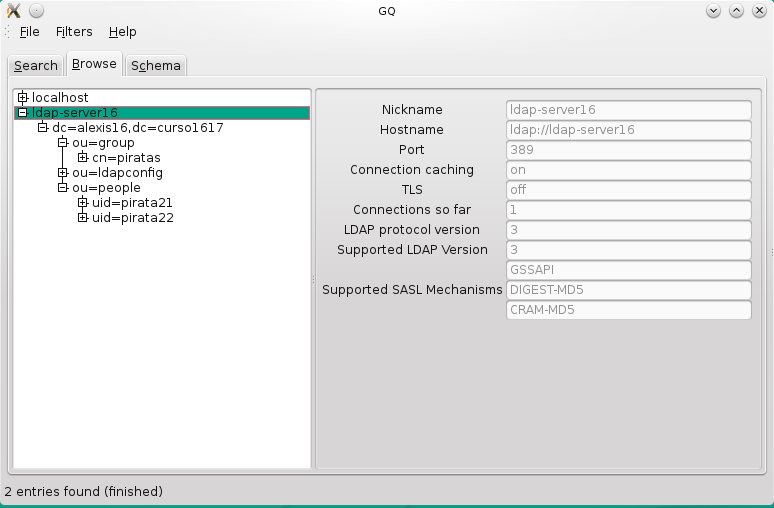

### 2.2. Instalar cliente LDAP

Debemos instalar el paquete *yast2-auth-client*, que nos ayudará a configurar la máquina para autenticación.

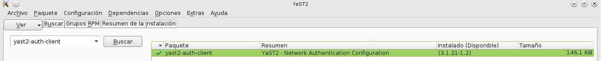

En *Yast* aparecerá como *Authentication Client*.

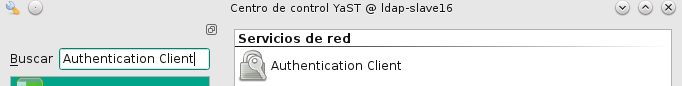

Iniciamos *Authentication Client* y procedemos a realizar la conexión con el servidor LDAP con las opciones que se indican a continuación.

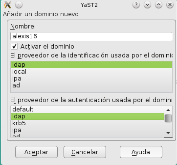

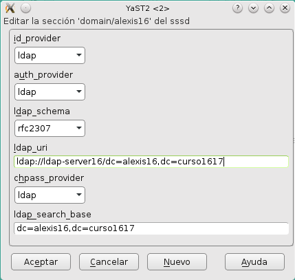
