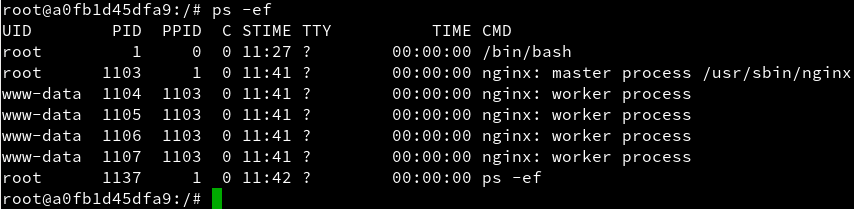

#Docker

##1. Introducción
Es muy común que nos encontremos desarrollando una aplicación y llegue el momento que decidamos tomar todos sus archivos y migrarlos ya sea al ambiente de producción, de prueba o simplemente probar su comportamiento en diferentes plataformas y servicios. Para situaciones de este estilo existen herramientas que, entre otras cosas, nos facilitan el embalaje y despliegue de la aplicación, es aquí donde entra en juego *Docker*.

Esta herramienta nos permite crear lo que ellos denominan contenedores, lo cual son aplicaciones empaquetadas auto-suficientes, muy livianas que son capaces de funcionar en prácticamente cualquier ambiente, ya que tiene su propio sistema de archivos, librerías, terminal, etc.

##2. Requisitos
Para esta actividad vamos a usar un máquina virtual con openSUSE Leap 42.2. Debemos configurar la máquina según las indicaciones del profesor. Una vez configurada, ejecutamos los siguientes comandos de comprobación:

Comando ***date***

Tenemos que asegurarnos que la máquina tiene una versión del Kernel 3.10 o superior. Para ello, ejecutamos el comando ***uname -a***.

Comandos ***hostname -f***, ***hostname -a*** y ***hostname -d***

Comando ***tail -n 5 /etc/passwd***

Comando ***ip a***

Comando ***route -n***

Comando ***ping 8.8.4.4***

Comando ***host www.iespuertodelacruz.es***

Comando ***blkid***

##3. Instalación y primeras pruebas
Comenzamos instalando *docker* con el comando ***zypper in docker***.

A continuación iniciamos el servicio con el comando ***systemctl start docker*** y comprobamos el estado con ***systemctl status docker***.

Ejecutamos ***docker version*** para ver la información del cliente y del servidor.

Con el comando ***usermod -a -G docker alexis*** añadimos permisos a nuestro usuario para que pueda usar *Docker*.

Cerramos sesión y volvemos a entrar con nuestro usuario para comprobar que todo funciona correctamente mediante el lanzamiento de los siguientes comandos:

Comando ***docker images***

Comando ***docker ps -a***

Con el comando ***docker run hello-world*** descargamos y ejecutamos un contenedor con la imagen hello-world.

Ahora volvemos a ejecutar los comandos ***docker images*** y ***docker ps -a*** para comprobar que tenemos disponible el contenedor de la imagen hello-world.

##4. Configuración de la red
Si queremos que nuestro contenedor tenga acceso a la red exterior, tenemos que ir a Yast -> Dispositivos de red -> Encaminamiento, y seleccionamos la casilla *Habilitar reenvío de IPv4*.

##5. Crear un contenedor manualmente
Nuestro SO base es OpenSUSE, pero vamos a crear un contenedor Debian8, y dentro instalaremos Nginx.

###5.1. Crear una imagen
Comenzamos lanzando el comando ***docker images*** para ver las imágenes que tenemos disponibles localmente.

A continuación, buscamos en los repositorios de Docker Hub imágenes con la etiqueta *debian*, ejecutando el comando ***docker search debian***.

Una vez que hemos localizado la imagen *debian:8*, la descargamos con ***docker pull debian:8***.

Descargamos también la imagen *opensuse* con ***docker pull opensuse***.

Ejecutamos los comando ***docker ps -a*** y ***docker ps*** para ver todos los contenedores y los que están en ejecución.

A continuación, vamos a crear un contenedor con nombre *mv_debian* a partir de la imagen *debian:8*, y ejecutaremos */bin/bash*.

Ahora, estando dentro del contenedor vamos a realizar distintas acciones.
Con el comando ***cat /etc/motd*** comprobamos que estamos en *Debian*.

Continuamos actualizando los repositorios con el comando ***apt-get update***.

Seguimos ejecutando el comando ***apt-get install nginx*** para instalar el servidor web *Nginx*.

Instalamos tambíen *vim* lanzando ***apt-get install vim***.

Iniciamos el servicio nginx con ***/usr/sbin/nginx*** y ejecutamos ***ps -ef*** para comprobar que tiene procesos en ejecución.

Creamos un fichero *holamundo.html* con el siguiente contenido:

Creamos tambien un script */root/server.sh* con el siguiente contenido:

Ya tenemos nuestro contenedor auto-suficiente de Nginx. Ahora debemos crear una nueva imagen con los cambios que hemos hecho, para esto abrimos otra ventana de terminal y buscamos el ID de nuestro contenedor con el comando ***docker ps***.

Ahora podemos crear la nueva imagen a partir de los cambios que realizamos sobre la imagen base.

Ejecutamos ***docker images*** para comprobar que se ha creado nuestra imagen.

Ahora vamos a proceder a eliminar nuestro contenedor. Para ello, vamos a primero parar nuestro contenedor, comprobar que está parado y luego ya efectuamos la eliminación de nuestro contenedor.

###5.2. Crear contenedor
Bien, tenemos una imagen con Nginx instalado, probemos ahora la magia de Docker.

Iniciamos el contenedor con ***docker run --name=mv_nginx -p 80 -t alexis/nginx /root/server.sh***.

Ejecutamos ***docker ps*** para comprobar que está activo.

Accedemos desde un navegador web a *localhost:32768* y vemos que conectamos con *Nginx* dentro del contenedor.

Al igual que al finalizar el apartado anterior, procedemos a parar y eliminar nuestro contenedor.

###5.3. Más comandos
Información sobre otros comandos útiles:

* docker start CONTAINERID, inicia un contenedor que estaba parado.
* docker attach CONTAINERID, conecta el terminal actual con el interior de contenedor.

##6. Crear un contenedor con Dockerfile
Ahora vamos a conseguir el mismo resultado del apartado anterior, pero usando un fichero de configuración, llamado *Dockerfile*.

###6.1. Comprobaciones iniciales
Ejecutamos los comandos ***docker images***, ***dockers ps*** y ***docker ps -a***.

###6.2. Preparar ficheros
Creamos el directorio *docker* en nuestro *home*, para poner dentro los siguientes ficheros.

Fichero *Dockerfile*

Fichero *server.sh*

Fichero *holamundo.html*

###6.3. Crear imagen
El fichero Dockerfile contiene la información necesaria para contruir el contenedor. Nos movemos al directorio *docker*, ejecutamos ***docker images*** para ver las imágenes locales, y ***docker build -t alexis/nginx2 .*** para construir una imagen a partir del *Dockerfile*.

Comprobamos que se ha creado la imagen con el comando ***docker images***.

###6.4. Crear contenedor y comprobar
A continuación vamos a crear un contenedor con el nombre *mv_nginx2*, a partir de la imagen *alexis/nginx2*, y queremos que este contenedor ejecute el programa */root/server.sh*.

Ejecutamos ***docker ps*** y vemos que el contenedor está en ejecución.

Comprobamos en el navegador con la URL *http://localhost:32768*.

Comprobamos en el navegador con la URL *http://localhost:32768/holamundo.html*.

##7. Limpiar
Cuando terminamos con los contedores y ya no los necesitamos, es buena idea pararlos y/o destruirlos.
