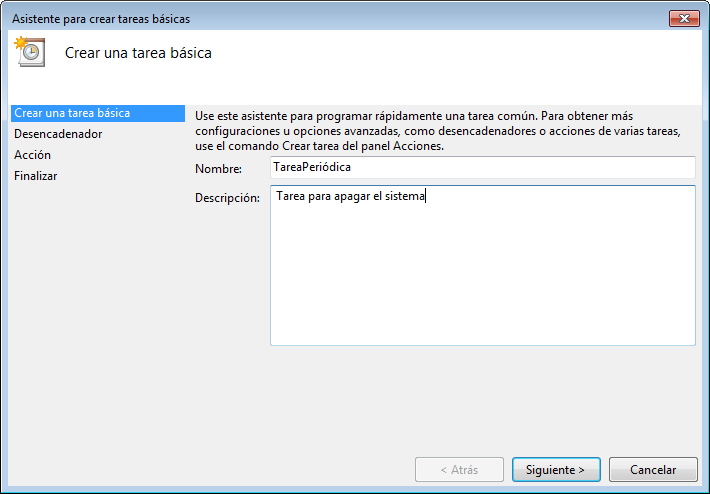
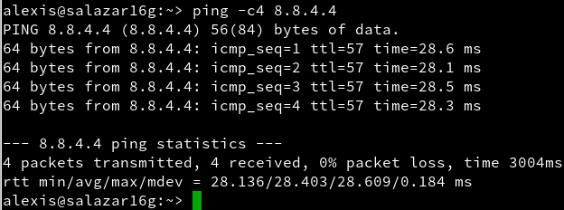

# Tareas programadas

## 1. Windows
Vamos a hacer una tarea programada y otra diferida con Windows.

### 1.1. Configuración
Comando ***date***

Comando ***hostname***

Comando ***ipconfig***

Comando ***route PRINT***

Comando ***nslookup www.iespuertodelacruz.es***

Comando ***ping 8.8.4.4***

### 1.2. Tarea diferida
La tarea diferida se define para ejecutarse una sola vez en una fecha futura.

Vamos a programar una tarea diferida para que nos muestre un mensaje en pantalla. Para ello, vamos a *Panel de control -> Herramientas administrativas -> Programador de tareas*, y seleccionamos *Crear una tarea básica*.

### 1.3. Tarea periódica
La tarea programada se define para ejecutarse periódicamente cada intervalo de tiempo.

Vamos a programar una tarea periódica para apagar el equipo.

## 2. openSUSE
Vamos a hacer una tarea programada y otra diferida con GNU/Linux.

### 2.1. Configuración

Comando ***date***

Comando ***uname -a***

Comandos ***hostname -f***, ***hostname -a*** y ***hostname -d***

Comando ***tail -n 5 /etc/passwd***

Comando ***ip a***

Comando ***route -n***

Comando ***ping 8.8.4.4***

Comando ***host www.iespuertodelacruz.es***

Comando ***blkid***

### 2.2. Tarea diferida
Creamos una tarea para las 12:50 que escriba el texto *'Hola Mundo'* en un fichero *README.txt*.

Comprobamos que se ha creado dicho fichero y vemos su contenido.

### 2.3. Tarea periódica
Vamos a programar una tarea periódica (crontab) para apagar el equipo.

Para programar una tarea periódica tenemos estas formas:

* Los usuarios usan el comando ***crontab*** para programar sus tareas.
* El usuario *root* usa el fichero */etc/crontab* para programar las tareas del sistema.

Como vamos a programar el apagado del sistema, usamos el fichero */etc/crontab*.

Esta tarea apagará el sistema cada día a las 13:32.

