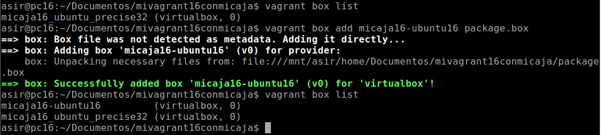

#Vagrant

##1. Introducción
*Vagrant* es una herramienta para la creación y configuración de entornos
de desarrollo virtualizados. Originalmente se desarrolló para VirtualBox
y sistemas de configuración tales como Chef, Salt y Puppet. Sin embargo
desde la versión 1.1 *Vagrant* es capaz de trabajar con múltiples
proveedores, como VMware, Amazon EC2, LXC, DigitalOcean, etc. Aunque
*Vagrant* se ha desarrollado en Ruby se puede usar en multitud de
proyectos escritos en otros lenguajes.

##2. Primeros pasos

###2.1. Instalación
La instalación debemos hacerla en una máquina real. Hay varias
formas de instalar *Vagrant*:

* Ejecutar el comando ***apt-get install vagrant***
* Usando un paquete *vagrant.deb* disponible para descargar del
  servidor Leela.

###2.2. Proyecto
Comenzamos creando un directorio ***mivagrant16*** en ***Documentos***
para nuestro proyecto *vagrant*. Ejecutamos ***vagrant init*** para
inicializar el directorio como un proyecto *vagrant*.

###2.3. Imagen, caja o box
Ahora necesitamos obtener una imagen de un sistema operativo.
Vamos a conseguir una imagen de un Ubuntu Precise de 32 bits con el
comando ***vagrant box add micaja16_ubuntu_precise32
http://files.vagrantup.com/precise32.box***. Ejecutamos ***vagrant box
list*** para ver las cajas que tenemos disponibles en nuestra máquina.

Para poder usar una caja determinada en nuestro proyecto, tenemos que
modificar el fichero *Vagrantfile*, que se encuentra dentro de la carpeta
de nuestro proyecto. Cambiamos la línea *config.vm.box = "base"* por
*config.vm.box ="micaja16_ubuntu_precise32"*.

###2.4. Iniciar una nueva máquina
Vamos a iniciar nuestra máquina virtual nueva usando *Vagrant*. Para
ello, nos situamos en la carpeta de nuestro proyecto y ejecutamos el
comando ***vagrant up***.

A continuación, se muestran algunos de los comandos más útiles de
*Vagrant*:

* ***vagrant ssh***: Conectar/entrar en nuestra máquina virtual usando
	SSH.
* ***vagrant suspend***: Suspender la máquina virtual.
* ***vagrant resume***: Volver a despertar la máquina virtual.
* ***vagrant halt***: Apagarla la máquina virtual.
* ***vagrant status***: Estado actual de la máquina virtual.
* ***vagrant destroy***: Para eliminar completamente la máquina virtual.

##3. Configuración del entorno virtual
###3.1. Carpetas sincronizadas
La carpeta del proyecto que contiene el *Vagrantfile* es visible para el
sistema
virtualizado, esto nos permite compartir archivos fácilmente entre los
dos entornos.

Para identificar las carpetas compartidas dentro del entorno virtual
ejecutamos los siguientes comandos:

Comando ***vagrant up***

Comando ***vagrant ssh***

Comando ***ls /vagrant***

###3.2. Redireccionamiento de los puertos
Cuando trabajamos con máquinas virtuales, es frecuente usarlas para
proyectos enfocados a la web, y para acceder a las páginas es necesario configurar el enrutamiento de puertos.

Para redireccionar los puertos, debemos modificar el fichero
*Vagrantfile*, de manera que el puerto 4567 del sistema anfitrión sea
enrutado al puerto 80 del ambiente virtualizado.

A continuación, recargamos la máquina para que utilice la nueva
configuración con el comando ***vagrant reload***.

Tenemos que confirmar que hay un servicio a la escucha en el puerto 4567.
Para ello, desde el sistema anfitrión ejecutamos los siguientes comandos:

Comando ***nmap -p 4500-4600 localhost***

Comando ***netstat -ntap***

Continuamos entrando a la máquina con ***vagrant ssh***,

e instalamos *Apache* ejecutando el comando ***apt-get install apache2***.

Para finalizar esta sección, abrimos un navegador web desde el sistema
anfitrión e introducimos la URL *http://127.0.0.1:4567*. Vemos que se
accede por el puerto 4567, pero en realidad estamos accediendo al puerto
80 de nuestro sistema virtualizado.

##4. Ejemplos

A continuación se muestran algunos ejemplos como información.

* Ejemplo para configurar la red:

        config.vm.network "private_network", ip: "192.168.33.10"

* Ejemplo para configurar las carpetas compartidas:

        config.vm.synced_folder "htdocs", "/var/www/html"

* Ejemplo, configurar en *Vagrantfile* la conexión SSH de vagrant nuestra
máquina:

		config.ssh.username = 'root'
  		config.ssh.password = 'vagrant'
  		config.ssh.insert_key = 'true'

* Ejemplo para configurar en *Vagrantfile* la ejecución remota de
aplicaciones gráficas instaladas en la máquina virtual, mediante SSH:

        config.ssh.forward_agent = true
  	  	config.ssh.forward_x11 = true

##5. Suministro
Uno de los mejores aspectos de *Vagrant* es el uso de herramientas de
suministro. Esto es, ejecutar "una receta" o una serie de scripts durante
el proceso de arranque del entorno virtual para instalar, configurar y
personalizar un sin fin de aspectos del SO del sistema anfitrión.

Ejecutamos los comandos ***vagrant halt*** y ***vagrant destroy*** para
apagar y destruir la máquina.

###5.1. Suministro mediante shell script
Vamos a suministrar a la MV un pequeño script para instalar Apache. Para
ello, creamos el script *install_apache.sh*, dentro del proyecto con el
siguiente contenido:

Asignamos permisos de ejecución al script con el comando ***chmod +x
install_apache.sh***.

A continuación debemos indicar a *Vagrant* que debe ejecutar dentro del
entorno virtual el archivo *install_apache.sh*. Para ello, modificamos el
archivo *Vagrantfile* y añadimos la línea *config.vm.provision :shell,
:path => "install_apache.sh"*.

Para continuar, volvemos a crear la máquina con ***vagrant up***.

Durante el proceso de creación de la máquina vemos que en los mensajes de
salida se muestran mensajes que indican que se va a instalar el paquete
de Apache que hemos indicado en el script *install_apache.sh*.

Para verificar que efectivamente el servidor Apache ha sido instalado e
iniciado, abrimos navegador en la máquina real con el URL
*http://127.0.0.1:4567*.

###5.2. Suministro mediante Puppet
Modificamos el archivo *Vagrantfile* para que acepte órdenes Puppet
añadiendo las siguientes líneas:

        config.vm.provision "puppet" do |puppet|
    		puppet.manifest_file = "default.pp"
  		end

Creamos un fichero ***manifests/default.pp***, con las instrucciones
Puppet para instalar el programa *nmap*.

Para comprobar que se ha aplicado la nueva configuración, creamos una
nueva máquina con ***vagrant up*** y vemos como se muestran en pantalla
que se han aplicado las instrucciones Puppet para instalar *nmap*.

Una vez creada la máquina, entramos en ella con ***vagrant ssh*** y
ejecutamos ***nmap localhost*** para comprobar que se ha instalado el
paquete *nmap*.

##6. Nuestra caja personalizada
En los apartados anteriores hemos descargado una caja de un
repositorio de Internet, y luego la hemos provisionado para
personalizarla. En este apartado vamos a crear nuestra propia caja
personalizada a partir de una máquina virtual de VirtualBox.

###6.1. Preparar la MV VirtualBox
Lo primero que tenemos que hacer es preparar nuestra máquina virtual con
una configuración por defecto, por si queremos publicar nuestro Box, ésto
se realiza para seguir un estándar y que todo el mundo pueda usar dicho
Box.

Para este apartado, podemos crear una nueva máquina virtual en VirtualBox
o usar una ya existente.

Comenzamos instalando el OpenSSH Server en la máquina virtual que vamos a
usar.

A continuación, creamos el usuario *vagrant* con el comando ***useradd -m
vagrant***, para poder acceder a la máquina virtual por SSH.

A este usuario le agregamos una clave pública para autorizar el acceso
sin clave desde *Vagrant*.

Ponemos clave *vagrant* al usuario *vagrant* y al usuario *root*.

Tenemos que conceder permisos al usuario *vagrant* para que pueda
configurar la red, instalar software, montar carpetas compartidas, etc.
Para ello debemos configurar el fichero ***/etc/sudores***, añadiendo la
línea *vagrant ALL=(ALL) NOPASSWD: ALL*, para que no nos solicite la
contraseña de *root*, cuando realicemos estas operaciones con el usuario
*vagrant*.

También debemos asegurarnos que tenemos instalado las VirtualBox Guest
Additions, para conseguir mejoras en el sistema operativo o poder
compartir carpetas con el anfitrión.

###6.2. Crear la caja vagrant
Una vez hemos preparado la máquina virtual ya podemos crear nuestra caja
*Vagrant* personalizada.

Vamos a crear una nueva carpeta ***mivagrant16conmicaja***, para este
nuevo proyecto *Vagrant*. Una vez creada, ejecutamos ***vagrant init***
para crear el nuevo fichero de configuración.

A continuación, localizamos el nombre de nuestra máquina Virtual y vamos
a proceder a crear la caja ***package.box*** a partir de nuestra máquina
virtual con el comando ***vagrant package - -base ubuntu-16***.

Comprobamos que se ha creado la caja ***package.box*** en el directorio
donde hemos ejecutado el comando.

Mostramos la lista de cajas disponibles con el comando ***vagrant box
list***. Sólo aparece una caja porque todavía no se ha añadido la que
acabamos de crear. Para finalizar, añadimos la  nueva caja al repositorio
de *Vagrant* ejecutando ***vagrant box add micaja16-ubuntu16
package.box***. Lanzamos el comando ***vagrant box list*** para ver que
la caja se ha añadido correctamente.

Para poder usar una caja determinada en nuestro proyecto, tenemos que
modificar el fichero *Vagrantfile*, que se encuentra dentro de la carpeta
de nuestro proyecto. Cambiamos la línea *config.vm.box = "base"* por
*config.vm.box ="micaja16-ubuntu16"*.

Ejecutamos el comando ***vagrant up*** para iniciar nuestra máquina virtual personalizada.

Para finalizar, lanzamos el comando ***vagrant ssh*** para conectarnos a la máquina.

